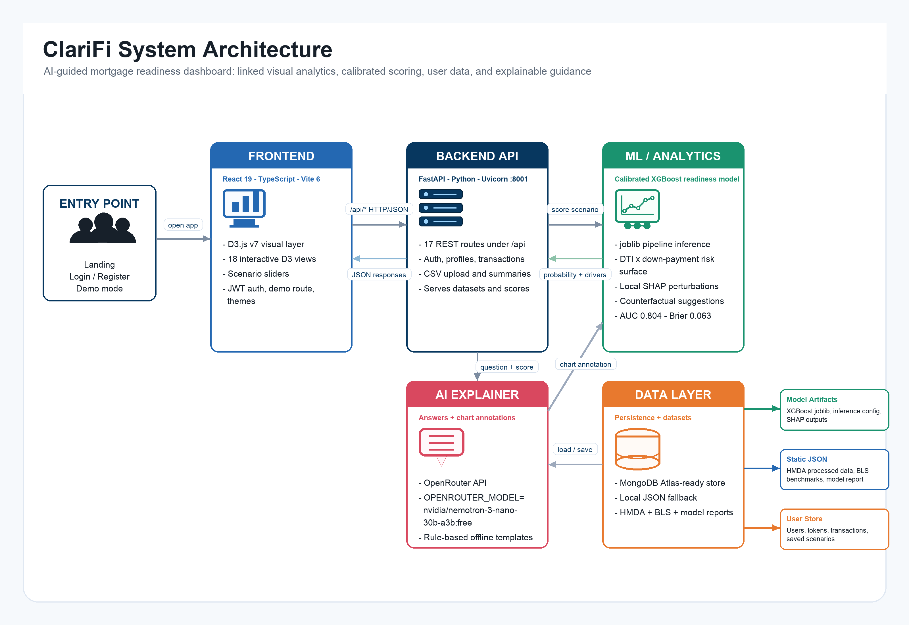
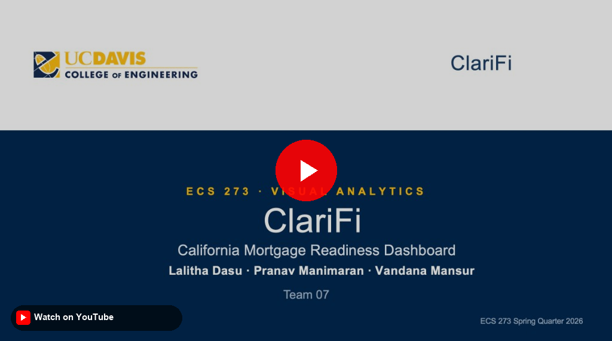

# ClariFi

ECS 273 Team 7 — Lalitha Dasu, Pranav Manimaran, Vandana Mansur

## Description

ClariFi is an AI-guided personal finance and **mortgage readiness** visual analytics system for California households. Users upload monthly transaction CSVs (or use demo personas), adjust budget and what-if sliders, and see an **educational** approval-likelihood score driven by a calibrated **XGBoost** model trained on roughly **58,000** stratified-sampled **HMDA 2025** California applications. The dashboard exposes **18 linked views**, county choropleth, income histogram with brushing, HMDA scatter, risk-surface heatmap, SHAP-style explanations, BLS peer benchmarks, and more—so users can relate personal cashflow to regional market patterns before applying for a loan.

The stack is a **React + D3** front end, a **FastAPI** back end (scoring, scenario API, optional LLM explanations), and a data layer (processed HMDA JSON, BLS benchmarks, model artifacts under `client/public/data/model_outputs/`, MongoDB Atlas with **local JSON fallback** for auth and saved scenarios). Scoring features align with the Colab notebook via `scenario_inference_config.json`; the UI debounces slider updates and links map, histogram, and scatter through shared state.

The readiness score is **not** a credit decision or financial advice.

### For course staff (TA grading)

**Environment file:** API keys and MongoDB settings are **not** committed to git. We submitted **`env.txt`** on **Canvas** (course submission). To run with full functionality (Atlas + optional AI explainer):

1. Download **`env.txt`** from our Canvas submission.
2. Copy it to the project root as **`.env`** (same variable names as `.env.example`).

If `.env` is missing, the app still runs: auth uses `client/public/data/local_store.json` (seeded from `local_store.seed.json`), and the LLM agent falls back to rule-based templates.




## Installation

**Follow along with this YouTube video to install the application:** [ClariFi Installation | YouTube](https://youtu.be/6YLAViYwFs0)

### 0. Project Walkthrough Video Presentaion 

[](https://www.youtube.com/watch?v=Zj4npYkmaUA)

### Prerequisites

- **Python 3.11+** (backend)
- **Node.js 18+** and **npm** (frontend)
- **Git** (clone)

### 1. Clone and environment

```bash
git clone https://github.com/vandanacm/ClariFi.git
cd ClariFi
```

Copy **`.env`** from the course **`env.txt`** on Canvas (see [For course staff](#for-course-staff-ta-grading))


### 2. Backend + ML engine

```bash
cd server
python -m venv venv #optional
source venv/bin/activate   # Windows: venv\Scripts\activate
pip install -r requirements.txt
```

Confirm ML engine model artifacts exist (tracked in git):

| File | Purpose |
|------|---------|
| `client/public/data/model_outputs/hmda_2025_xgboost_calibrated_pipeline.joblib` | Live approval scoring |
| `client/public/data/model_outputs/scenario_inference_config.json` | Feature engineering for the API |
| `client/public/data/model_outputs/hmda_2025_xgboost_shap_report.json` | Calibration + diagnostics |

If missing, regenerate from `notebooks/hmda_2025_xgboost_shap.ipynb`.


### 3. Frontend

**Start the UI** (second terminal; API must already be on port 8001):

```bash
cd client
npm run dev
npm install
```

- App: http://127.0.0.1:5173 (Vite proxies `/api/*` → port 8001)

**Automated checks (optional):**

```bash
cd /path/to/ClariFi
pip install -r server/requirements.txt
python -m pytest tests/ -q
```

### Test users and sample data

You can explore the app without registering by clicking **"Explore demo →"** on the landing page. This uses a built-in demo account.

To test with different personas, use the pre-configured test users below. All share the password `Testpass123`:

| Name | Email | Persona | Target Market | Transaction CSV |
|---|---|---|---|---|
| Sofia Chen | `sofia.sf@clarifi.test` | High-income SF buyer (User not registered yet) | Alameda | `sf_high_income_transactions.csv` | 
| Arjun Patel | `arjun.bay@clarifi.test` | Median-plus SoCal buyer (User not registered yet) | San Diego | `bay_median_plus_transactions.csv` |
| Maya Gomez | `maya.sac@clarifi.test` | Mid-income Sacramento buyer (**video demo user**) | Sacramento | `sacramento_mid_income_transactions.csv` | 
| Diego Rivera | `diego.inland@clarifi.test` | Lower-income Inland renter (**application setup demo user**) | Los Angeles | `inland_lower_income_transactions.csv` | 

**Steps to test a persona:**

1. Register using the email and password from the table above (`Testpass123` for all).
2. After sign-in, upload the matching CSV from `server/data/user_upload_pack/`.
3. Adjust sliders and save scenarios; each persona produces a different readiness score and risk profile.


**Testing the re-upload flow:**

To test uploading a new CSV for an already-registered user, use `server/data/user_upload_pack/reupload_test_transactions.csv`. Log in as any existing account, click **Upload CSV** in the top-right header, and select this file. The dashboard metrics will update immediately without a page refresh (~$9,200/mo income, $870 debt, $600/mo savings, 2 months of data).

## Project Structure

```
ClariFi/
├── client/
│   ├── public/data/              # Published runtime data (Vite /api static)
│   │   ├── hmda_processed.json   # Choropleth, scatter, histogram
│   │   ├── bls_benchmarks.json
│   │   ├── model_report.json
│   │   ├── model_outputs/        # XGBoost .joblib, SHAP JSON, scenario config
│   │   ├── local_store.seed.json # Demo user seed (tracked)
│   │   └── local_store.json      # Auth fallback (gitignored; auto-created)
│   └── src/                      # React + D3 dashboard
├── server/
│   ├── data/                     # Pipeline inputs + demo CSV uploads
│   │   ├── hmda_2025_sample_60000.csv
│   │   └── user_upload_pack/
│   ├── paths.py                  # Canonical paths (server + client data)
│   └── main.py                   # FastAPI, ML scoring, LLM
├── notebooks/                    # Train model → copy artifacts to public/data/
└── .env.example
```

See `server/data/README.md` for the server vs client data split.

## Dashboard layout (top → bottom)

Linked views follow a natural readiness workflow:

1. **Readiness score** — XGBoost approval probability and key metrics (DTI, surplus)
2. **Budget mixer** — expense donut + sliders (housing, debt, flexible spending) — primary monthly controls
3. **Cashflow waterfall** — linked to budget mixer
4. **What-if simulator + BLS benchmarks** — income, debt, savings, target price
5. **Readiness planning** — guideline gauges, DTI breakdown, counterfactual, savings path, affordability, payment stack, loan programs, rate sensitivity
6. **HMDA market context** — county map (fixed 38–85% scale), scatter, histogram (bidirectional brushing)
7. **Model audit** — performance, peer comparison, global/local SHAP, calibration, risk surface

## Visualizations (D3.js)

Advanced charts are implemented with **D3 v7** (`client/package.json`). Primary D3 modules include scales, axes, brushing, geo projections, and transitions in:

`ChoroplethMap`, `HmdaScatter`, `IncomeHistogram`, `RiskSurface`, `ExpenseDonut`, `CashflowChart`, `RateSensitivityChart`, `ShapWaterfallChart`, `GlobalFeatureImportance`, `CalibrationChart`, `SavingsTimeline`, plus shared helpers in `chart-utils.ts`.

Simpler read-only bars (e.g. counterfactual, guideline gauges) use lightweight SVG for layout; linked interactions and market views rely on D3.

## Linked views and interactions

**Cross-chart links:** Budget mixer ↔ Cashflow, Simulator → All views (debounced 250ms), Histogram ↔ Scatter ↔ Map (bidirectional brushing), Risk Surface → Sliders (click-to-apply), Agent → Charts (AI annotations).

## Core Datasets

- **HMDA Modified LAR (2025 California)**: The full 2025 HMDA dataset contains ~12 million records nationally. We filtered to California and stratified-sampled ~5,000 rows per month to create a ~58,000-row training set for the XGBoost model, scatter plot, histogram, and choropleth
- **BLS Consumer Expenditure Survey**: Peer spending benchmarks by income band and region
- **XGBoost model**: Calibrated approval probability trained on HMDA data (AUC 0.804, Brier 0.063, 300 trees, isotonic calibration)

## Known Issues and Limitations

- The XGBoost model is trained on California HMDA data only — predictions may not generalize to other states
- The readiness score is for educational purposes only and is not a credit decision or financial advice
- If OpenRouter API keys are not set, the AI explainer falls back to rule-based templates
